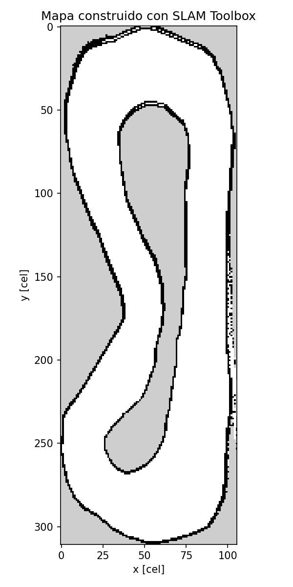
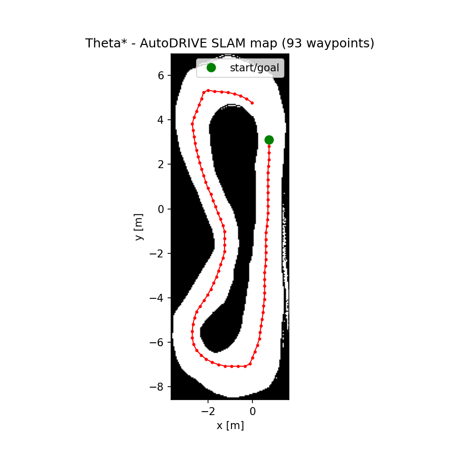
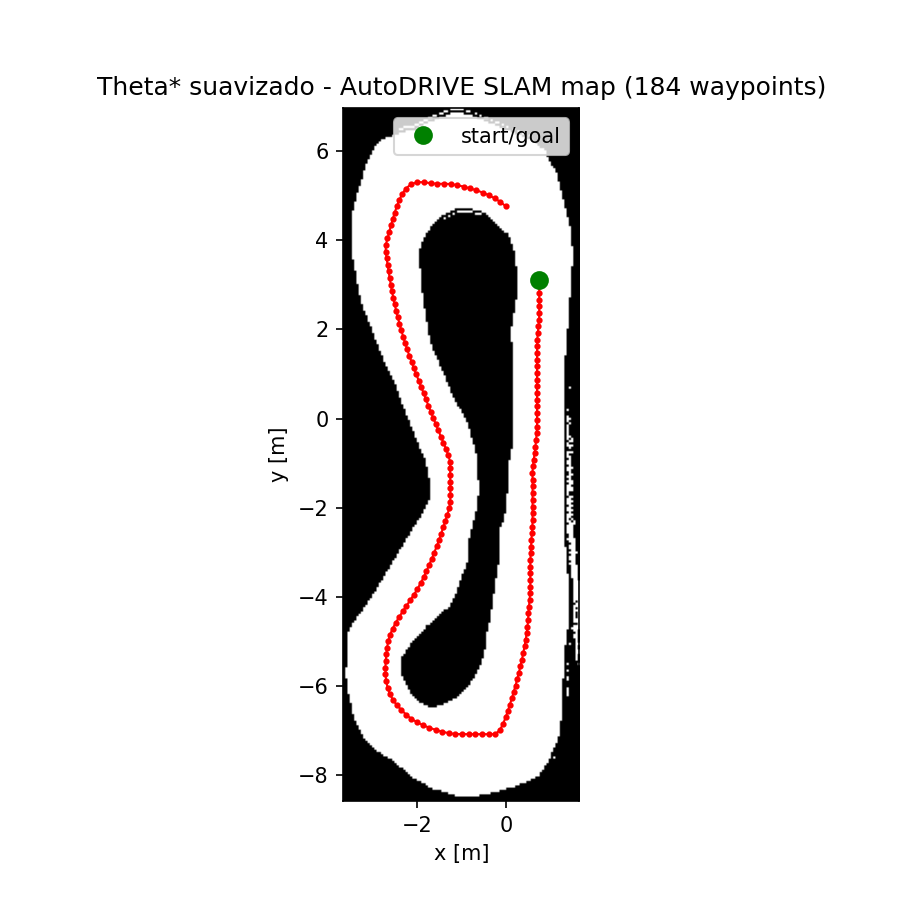
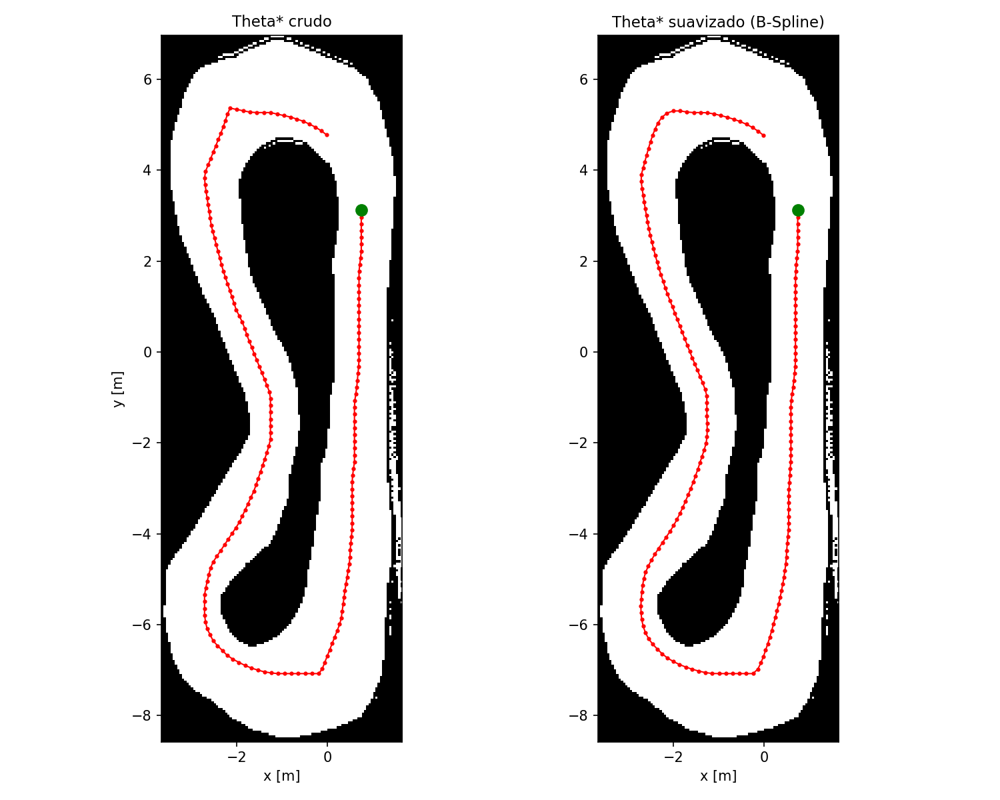
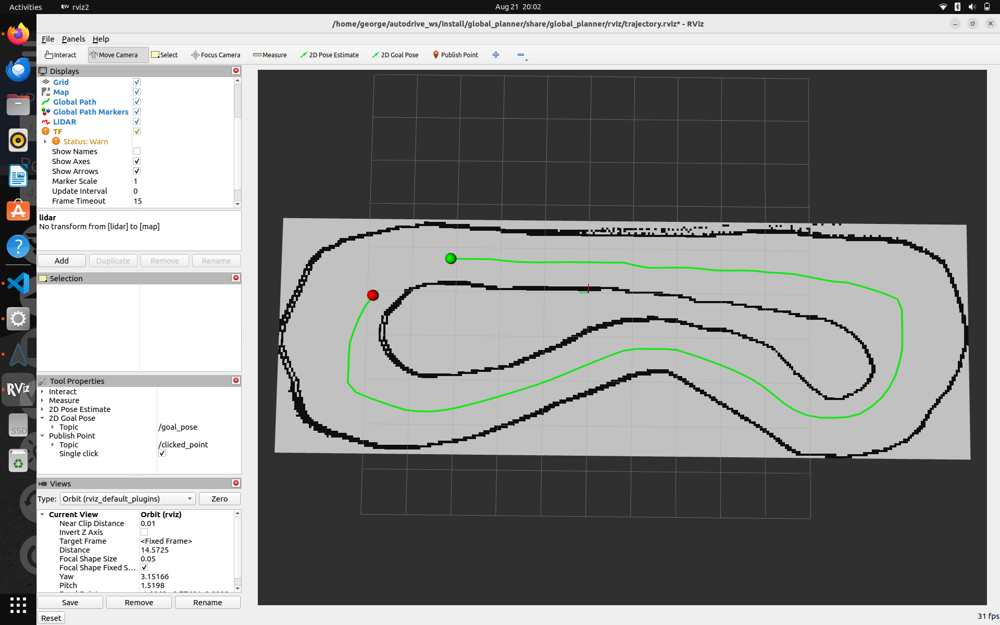

# Mapeo y Planificación Global de Trayectorias en AutoDRIVE — Theta* + Suavizado B-Spline

Proyecto desarrollado en el marco de la materia **Vehículos No Tripulados**, sobre el circuito F1TENTH del simulador **AutoDRIVE**. Cubre tres etapas: construcción de un mapa 2D del entorno mediante **SLAM** (SLAM Toolbox), planificación de una trayectoria global con **Theta\*** desde el punto de spawn del vehículo hasta cerrar la vuelta completa, **suavizado** de esa trayectoria con una B-Spline paramétrica, y visualización del resultado final superpuesto sobre el mapa dentro del simulador.

## Videos de evidencia

- 📹 **Mapeo (SLAM en ejecución):** [https://youtu.be/L9TflLghGQY](https://youtu.be/L9TflLghGQY)
- 📹 **Planificación, suavizado y visualización final:** [https://youtu.be/yUsBcBaHa3A](https://youtu.be/yUsBcBaHa3A)

---

## 1. Instalación

### 1.1 Requisitos previos

Este repositorio **no** reemplaza la instalación del simulador AutoDRIVE ni del puente ROS 2 (`autodrive_f1tenth`) — se asume que eso ya está hecho siguiendo el [Tutorial 1 de instalación](https://github.com/nabihandres/AUTODRIVE/blob/main/Tutorial%201%3A%20AutoDrive%20Installation%20and%20Setup.md) del curso:

- **ROS 2 Humble**
- **AutoDRIVE Simulator** (`AutoDRIVE Simulator.x86_64`) y el workspace con el paquete `autodrive_f1tenth` ya compilado (`ros2 pkg list | grep autodrive_f1tenth` debe encontrarlo)
- **SLAM Toolbox**: `sudo apt install ros-humble-slam-toolbox`
- **Nav2 map server** (para servir el mapa en la visualización final): `sudo apt install ros-humble-nav2-map-server ros-humble-nav2-lifecycle-manager`

### 1.2 Dependencias de Python de este paquete

```bash
sudo apt install python3-opencv python3-numpy python3-matplotlib python3-yaml python3-pillow python3-scipy
pip3 install osqp
```

(`osqp` es dependencia de un módulo de `python_motion_planning` que este proyecto no usa directamente, pero que se importa igual al cargar la librería — no tiene paquete `apt` estándar.)

### 1.3 Clonar y compilar

```bash
cd ~
git clone https://github.com/ggilerv/Mapping-and-ThetaPlanning-Trayectory-AutoDrive.git
cd Mapping-and-ThetaPlanning-Trayectory-AutoDrive
source /opt/ros/humble/setup.bash
colcon build --symlink-install
```

Para ejecutar cualquier comando de este repositorio hace falta tener sourceados **ambos** workspaces (el de `autodrive_f1tenth` y este):

```bash
source /opt/ros/humble/setup.bash
source ~/autodrive_ws/install/setup.bash          # el workspace con autodrive_f1tenth
source ~/Mapping-and-ThetaPlanning-Trayectory-AutoDrive/install/setup.bash
```

---

## 2. Estructura del repositorio

```
├── img/                                  <- Imágenes usadas en este README
└── src/
    └── global_planner/                   <- Único paquete ROS 2 (ament_python) de este repositorio
        ├── package.xml
        ├── setup.py
        ├── setup.cfg
        ├── resource/global_planner
        ├── config/
        │   ├── mapper_params_online_async.yaml   <- Parámetros de SLAM Toolbox
        │   └── slam_mapping.rviz                 <- Config de RViz para ver el mapa construyéndose
        ├── launch/
        │   └── trajectory_visualization.launch.py  <- Levanta mapa + bridges + trayectoria + RViz
        ├── rviz/
        │   └── trajectory.rviz                   <- Config de RViz para la visualización final
        ├── maps/
        │   ├── F1tenth_Map.pgm                   <- Mapa entregable
        │   └── F1tenth_Map.yaml
        ├── waypoints/                             <- Resultados entregables
        │   ├── theta_star_waypoints.csv/.png              <- Trayectoria cruda
        │   ├── theta_star_waypoints_smooth.csv/.png        <- Trayectoria suavizada
        │   ├── comparacion_crudo_vs_suavizado.png          <- Comparación visual
        │   └── theta_star_search.gif                       <- Animación de Theta* buscando
        └── global_planner/                        <- Módulo Python del paquete
            ├── planning_utils.py                  <- Theta*/RRT + suavizado (ver sección 4)
            ├── python_motion_planning/             <- Librería vendorizada (GPL-3.0, ver su LICENSE)
            ├── generate_trajectory.py              <- Genera la ruta cruda
            ├── smooth_trajectory.py                <- Suaviza la ruta
            ├── generate_gif.py                     <- Genera el .gif de Theta* buscando
            └── global_path_publisher.py            <- Nodo ROS 2: publica la ruta para RViz
```

`python_motion_planning` (Theta*, RRT, B-Spline y las clases base `Grid`/`Node`/`Env` que usan) está **vendorizado dentro del propio paquete** en vez de depender de un repositorio externo, para que este repositorio sea 100% autocontenido: clonar y compilar alcanza, no hace falta tener ningún otro repositorio del curso descargado aparte del workspace de `autodrive_f1tenth` mencionado en 1.1.

---

## 3. Mapeo del entorno (SLAM)

### 3.1 Cómo se construyó el mapa

Con el simulador AutoDRIVE corriendo (escenario F1TENTH) y el vehículo controlado manualmente, se corrió `slam_toolbox` en modo `mapping` (`config/mapper_params_online_async.yaml`, incluido en este repo) mientras se manejaban dos vueltas al circuito a velocidad baja, para que el escaneo del LiDAR tuviera tiempo de converger bien en las zonas más angostas. El mapa resultante se guardó con `nav2_map_server`/el panel de SlamToolbox como `F1tenth_Map.pgm` + `.yaml` (mapa *trinario*: 0 = ocupado, 205 = desconocido, 254 = libre).

### 3.2 Cómo reproducirlo

```bash
# Terminal 1 — Simulador AutoDRIVE (escenario F1TENTH)
~/Downloads/AutoDRIVE_Sim/AutoDRIVE\ Simulator.x86_64 &

# Terminal 2 — Bridge Unity <-> ROS 2 (del workspace de autodrive_f1tenth)
source /opt/ros/humble/setup.bash
source ~/autodrive_ws/install/setup.bash
ros2 launch autodrive_f1tenth simulator_bringup_headless.launch.py

# Terminal 3 — SLAM Toolbox (usando la config de este repo)
source /opt/ros/humble/setup.bash
source ~/autodrive_ws/install/setup.bash
source ~/Mapping-and-ThetaPlanning-Trayectory-AutoDrive/install/setup.bash
ros2 launch slam_toolbox online_async_launch.py \
  slam_params_file:=$(ros2 pkg prefix global_planner)/share/global_planner/config/mapper_params_online_async.yaml \
  use_sim_time:=true

# Terminal 4 — RViz para ver el mapa construyéndose en vivo
rviz2 -d $(ros2 pkg prefix global_planner)/share/global_planner/config/slam_mapping.rviz
```

Manejar despacio, dando un par de vueltas al circuito (con el control nativo del simulador o con `ros2 run autodrive_f1tenth teleop_keyboard`), y guardar el mapa desde el panel SlamToolboxPlugin de RViz (campo de ruta → botón "Save Map") o con `ros2 run nav2_map_server map_saver_cli -f <ruta>/F1tenth_Map`.

### 3.3 Resultado

| Mapa construido |
|:---:|
|  |

---

## 4. Planificación global (Theta\*) y suavizado (B-Spline)

### 4.1 Algoritmo de planificación: Theta\*

**Theta\*** (`global_planner/python_motion_planning/global_planner/graph_search/theta_star.py`) es una variante de A* de "cualquier ángulo": además de conectar celdas vecinas de la grilla, comprueba con un chequeo de línea de vista (Bresenham) si el nodo padre de un nodo puede conectarse directamente con un vecino sin cruzar un obstáculo, evitando así quedar atado a la geometría de la grilla (rutas más cortas y con menos quiebres que A*).

Theta* es un planificador punto-a-punto (siempre da el camino más corto entre un inicio y una meta), así que para cubrir la vuelta completa del circuito se reparten 8 checkpoints por ángulo alrededor del anillo transitable y se planifica un tramo entre cada par consecutivo, concatenando el resultado.

### 4.2 Algoritmo de suavizado: B-Spline paramétrica centrípeta

Se usa una B-Spline de interpolación (`python_motion_planning/curve_generation/bspline_curve.py`) con parametrización centrípeta (necesaria porque la trayectoria es un lazo cerrado). A diferencia de la ruta cruda de Theta* (segmentos rectos entre vértices de la grilla, con cambios de rumbo abruptos), la curva suavizada pasa por los mismos puntos pero con curvatura continua, factible para un vehículo con radio de giro limitado.

### 4.3 Modificaciones/funciones nuevas respecto a la librería base

- **`find_track_mask()` / `track_checkpoints()`** (en `generate_trajectory.py`): el mapa de SLAM es *trinario* (ocupado/desconocido/libre) y tiene decenas de manchitas de ruido de 1-70 px sueltas por sensor. La pista real es la componente conexa de espacio libre más grande (~65x más grande que la siguiente), así que estas funciones identifican el anillo transitable por **tamaño de componente**, en vez del criterio de "menor fill-ratio" que usa el resto de este proyecto para mapas sintéticos de circuito con infield/outfield.
- **`anchor_checkpoints()`**: ancla el inicio/fin de la vuelta exactamente al punto de spawn real del vehículo en AutoDRIVE (leído una vez de `/autodrive/f1tenth_1/ips`), en vez de un punto arbitrario elegido por ángulo — así la trayectoria publicada arranca justo donde aparece el auto.
- **`CenteredThetaStar`** (en `planning_utils.py`): penaliza el costo de cada paso según la distancia mínima a la pared más cercana a lo largo de todo el paso (no solo en sus extremos), para que la propia búsqueda de "camino más corto" prefiera el centro del corredor en vez de pegarse a los bordes.
- **`smooth_path_safe()`** (en `planning_utils.py`): la B-Spline de interpolación tiene más libertad de "cortar camino" cuantos menos puntos de control usa (curva más suave), pero eso también puede hacer que roce una pared en una curva cerrada. Esta función prueba una escalera de valores de puntos de control (de más agresivo a más conservador) y usa el primero cuya curva completa no cae sobre ningún obstáculo — no una cantidad fija de suavizado.
- **`chaikin_smooth()`** (en `smooth_trajectory.py`): cada uno de los 8 tramos se planifica por separado, así que la dirección de llegada a un checkpoint y la de salida del siguiente tramo no tienen por qué coincidir. En los checkpoints ubicados sobre las curvas más cerradas del circuito eso se notaba como un vértice marcado en la trayectoria suavizada, porque la spline de interpolación está obligada a pasar exactamente por ese punto. Por eso, antes de la B-Spline se aplica un pre-redondeo de esquinas (algoritmo de Chaikin) sobre el camino crudo completo, manteniendo fijo únicamente el punto de spawn (inicio/fin de la vuelta).
- **`open_loop_gap()`**: como la vuelta es un lazo cerrado, recorta el extremo final para dejar una separación visible (2 m) entre el punto de inicio y el de meta, en vez de que ambos queden superpuestos.
- **Espaciado más fino en la trayectoria suavizada** (`--spacing 0.15` en `smooth_trajectory.py`, contra `0.3` en la ruta cruda): en una curva muy cerrada, un espaciado grueso deja pocos waypoints para representar el arco, y las líneas rectas entre ellos se ven como un vértice aunque la curva de fondo sea continua. Achicar el espaciado solo en el resultado final resuelve eso sin afectar la ruta cruda de comparación.

### 4.4 Variables importantes

| Parámetro | Valor por defecto | Qué controla |
|---|---|---|
| `--checkpoints` / `--segments` | 8 / 8 | En cuántos tramos se divide la vuelta completa |
| `--penalty-weight` | 3.0 | Qué tan fuerte se penaliza pasar cerca de una pared (Theta*) |
| `--spacing` | 0.3 m (`generate_trajectory.py`) / 0.15 m (`smooth_trajectory.py`) | Separación entre waypoints finales |
| `--start-x` / `--start-y` | 0.741 / 3.158 | Punto de spawn del vehículo (inicio/fin de la vuelta) |
| `--gap` | 2.0 m | Separación entre el final y el inicio de la vuelta cerrada |
| `--smooth-step` | 0.0008 | Densidad de muestreo de la curva suavizada |
| `--corner-rounding-iterations` | 2 | Iteraciones de pre-redondeo de esquinas (Chaikin) antes de la B-Spline |

### 4.5 Cómo ejecutar

```bash
source /opt/ros/humble/setup.bash
source ~/autodrive_ws/install/setup.bash
source ~/Mapping-and-ThetaPlanning-Trayectory-AutoDrive/install/setup.bash

ros2 run global_planner generate_trajectory   # ruta cruda -> waypoints/theta_star_waypoints.csv
ros2 run global_planner smooth_trajectory     # ruta suavizada -> waypoints/theta_star_waypoints_smooth.csv
ros2 run global_planner generate_gif          # animación de Theta* buscando -> waypoints/theta_star_search.gif
```

No requieren el simulador corriendo (son scripts offline sobre el mapa ya guardado).

### 4.6 Resultados

Se verificó que ningún waypoint (crudo ni suavizado) cae sobre un obstáculo (chequeo contra la grilla de ocupación, 0 colisiones en ambos casos).

| Trayectoria cruda (Theta\*) | Trayectoria suavizada (B-Spline) |
|:---:|:---:|
|  |  |

| Comparación cruda vs. suavizada (detalle) |
|:---:|
|  |

---

## 5. Visualización final en el simulador

El nodo `global_path_publisher` publica la trayectoria suavizada (`nav_msgs/Path` + `visualization_msgs/MarkerArray` — línea verde, esfera verde en el inicio, esfera roja en el final) sobre `/global_path` / `/global_path_markers`, en el mismo frame `map` donde se sirve el mapa de SLAM.

```bash
# Con el simulador AutoDRIVE ya abierto y conectado:
source /opt/ros/humble/setup.bash
source ~/autodrive_ws/install/setup.bash
source ~/Mapping-and-ThetaPlanning-Trayectory-AutoDrive/install/setup.bash

ros2 launch global_planner trajectory_visualization.launch.py
```

Esto levanta junto: `nav2_map_server` (sirviendo el mapa guardado en la etapa de mapeo), los bridges de AutoDRIVE, `global_path_publisher`, y RViz ya configurado con el mapa, el LiDAR y la trayectoria.

| Trayectoria suavizada superpuesta en RViz |
|:---:|
|  |

---

## Licencia

El código propio de este repositorio se distribuye bajo licencia MIT. La librería vendorizada `src/global_planner/global_planner/python_motion_planning/` (Theta*, RRT, B-Spline, clases base de entorno) es de [ai-winter/python_motion_planning](https://github.com/ai-winter/python_motion_planning), distribuida bajo licencia GPL-3.0 (ver `python_motion_planning/LICENSE`).
